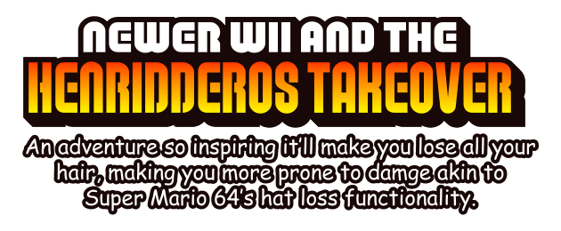

## Credits

 - Nintendo - New SUPER MARIO BROS. Wii, misc.
 - Newer Team - Newer SUPER MARIO BROS. Wii, misc.
 - Ryguy - New SUPER MARIO BROS. Wii... er+, and all of the hacks that have been derived from there
 - MandyIGuess - Some code I borrowed from RealismFW, maybe other things I think
 - Asu-chan - Hi
 - Realism Studios - Developing this mod of a mod
 - Henridderos14 - Spam pinging me on Discord so much that I made this mod out of sheer rage
   * fun fact: this was only supposed to be a compiled version of the newer map view feature, but the way henri kept spam pinging me inspired  me to "spam" this with AWESOME and HELPFUL features and NEW(er) content...
 - 0D - Cool person and you should check out [Super Mario Aftermath (definitely the newest trailer btw)](https://www.youtube.com/watch?v=QOSTEy8KGGg) okay thanks
 - Krubby - Giving me dementia
 - Krubby - Giving me dementia
 - Krubby - Giving me dementia
 - Krubby - Giving me dementia
 - Krubby - Giving me dementia
 - Krubby - Giving me dementia
 - Krubby - Giving me dementia
 - Krubby - Giving me dementia
 - Krubby - Giving me dementia
 - Krubby - Giving me dementia
 - Krubby - Giving me dementia
 - Krubby - Giving m
 - Anyone else I forgot - Sorry!!!

## Source Code Public Release

### Original Preamble (NewerSMBW)

Well, here it is, the thing you've been awaiting for... years. Yep.
My original plans were to majorly clean up and reorganise the codebase and
tools, because I really wasn't satisfied with the current state of them.

Unfortunately, this didn't quite pan out - as much as I'd like to have done
this, getting everything into the state I wanted would require months upon
months of work - something that's a bit difficult to do nowadays, since Newer
is done and I don't wish to devote yet more of my life to projects related to
NSMBW.

So... I've decided to dump the source code here so other people can do
something with this. Much of it isn't really in a usable state - but I'm
releasing it in case someone else wants to take up development and work on
getting everything polished and ready.

*-Ninji, 22nd November 2013*

### My Very Large Preamble

yeah so this is just newer except i added and changes a few features. thanks for listening to my speech

*- Kirblue, July 21st 2025 (european date formatting sucks)*

### Licensing

The Newer SMBW source code and tools, from which this mod is based off of, are released under the MIT license.
See the `LICENSE` file in this repository for full details.

Copyright (c) 2010-2025 Newer Team

## The Kamek information would normally go here, but I fear that that is extremely outdated and not very helpful to most.

## Installation

### Riivolution files / the game itself

[Here's a tutorial from Newer Team's website to help with setting up riivolution mods for **Both Dolphin Emulator and official hardware** (in the tutorial it shows NewerSMBW but it should work with every mod, and definitely this one.)](https://newerteam.com/wii/help/)

### Source code

don't use this mod's code lmao, it is a MESS. if you do and something goes horribly wrong, i will not be offering any support because:
- i'm kinda trash at coding
- no

### Bootstrap

i don't even know if newer uses this, but it's probably not very good for anyone's mental health to try and figure that out. if you're gonna recompile the loader stuff, you'd be better off using the Asu-chan (my goat...) thing ported to Codewarrior Kamek from 
[Synel's MoreSFX](https://github.com/Developers-Collective/NSMBW-Custom-Sprites/releases/tag/MoreSFX).

### Reggie! patch

who?

